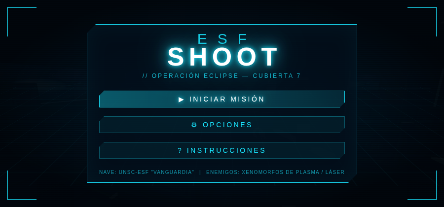
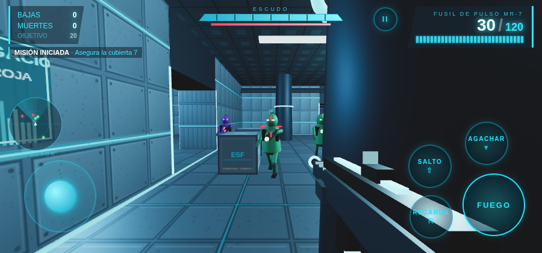

# ESFshoot

Shooter 3D en primera persona, futurista, para **Android**. Te enfrentas a xenomorfos armados con plasma y láser dentro de la cubierta 7 de la nave espacial *UNSC‑ESF "Vanguardia"*, con un HUD inspirado en Halo y controles táctiles en pantalla.




## Características

- **Motor 3D** con Three.js (WebGL) embebido en un `WebView` nativo a pantalla completa, modo inmersivo y orientación horizontal.
- **Mapa pequeño ambientado en una nave espacial**: hangar central con plataforma elevada, cuatro salas laterales con ventanas al espacio, cajas de suministros, pilares, pantallas holográficas y tiras de luz cian. Todo generado por código (texturas procedurales), sin assets externos.
- **Enemigos alienígenas** con IA (persecución, flanqueo, retirada, esquiva de obstáculos, línea de visión):
  - *Xeno de plasma*: ráfagas de 3 bolas de plasma verde.
  - *Xeno láser*: pulsos rojos rápidos y precisos.
  - Reaparecen tras morir para mantener 5 enemigos activos.
- **Fusil de pulso MR‑7** con modelo en primera persona y animaciones procedurales: retroceso, corredera, fogonazo con luz, balanceo al andar, vaivén al apuntar y **recarga en tres fases** (extracción del cargador, inserción y montado) con sonido.
- **Munición**: cargador de 30 + 120 de reserva, contador grande, indicador de balas y aviso de cargador bajo/recarga.
- **HUD estilo Halo**: escudo regenerativo segmentado con barra de vida, **marcador de bajas y muertes** con objetivo, kill‑feed, medallas ("DOBLE BAJA", "TIRO A LA CABEZA", rachas…), marcador de impacto, detector de movimiento (radar), viñeta de daño e indicador de dirección del atacante.
- **Controles táctiles**: joystick flotante de movimiento, mitad derecha de la pantalla para apuntar y botones de **FUEGO, RECARGA, SALTO, AGACHARSE** y pausa. En PC funciona con WASD + ratón (bloqueo de puntero), R, Espacio, C y Esc.
- **Menú futurista en cian**: rejilla animada, panel con recortes angulares, opciones (sensibilidad, invertir Y, disparo automático al apuntar, sonido, calidad gráfica), instrucciones, pausa, pantalla de muerte con cuenta atrás y resumen de misión (bajas, muertes, precisión, tiempo).
- **Sonido sintetizado** con WebAudio (disparo, recarga, plasma, láser, impacto, escudo, ambiente de la nave): no requiere archivos de audio.

Objetivo de la misión: eliminar **20 xenomorfos** para asegurar la cubierta.

## Estructura

```
ESFshoot/
├── app/
│   ├── build.gradle.kts                 # módulo Android (minSdk 24, targetSdk 35)
│   └── src/main/
│       ├── AndroidManifest.xml
│       ├── java/com/esfshoot/game/MainActivity.kt   # WebView inmersivo + botón atrás
│       ├── res/                          # tema, iconos adaptativos
│       └── assets/www/                   # el juego
│           ├── index.html                # menú, HUD y controles
│           ├── css/style.css             # estética cian
│           ├── js/audio.js               # sonidos WebAudio
│           ├── js/input.js               # joystick, mira táctil, botones, teclado/ratón
│           ├── js/world.js               # nave espacial, colisiones, texturas
│           ├── js/weapon.js              # fusil, animaciones, efectos
│           ├── js/enemies.js             # aliens, IA, proyectiles
│           ├── js/hud.js                 # HUD estilo Halo
│           ├── js/game.js                # bucle principal, jugador, partida
│           └── lib/three.min.js          # Three.js r158
├── build.gradle.kts
├── settings.gradle.kts
└── gradle/wrapper/
```

## Compilar el APK

Requisitos: JDK 17+, Android SDK (platform 35, build‑tools 35) o Android Studio.

```bash
# APK de depuración
./gradlew assembleDebug
# → app/build/outputs/apk/debug/app-debug.apk

# APK de release (firmado con la clave de depuración por defecto; configura tu firma para publicar)
./gradlew assembleRelease
```

Instalar en un dispositivo conectado:

```bash
adb install -r app/build/outputs/apk/debug/app-debug.apk
```

También puedes abrir la carpeta en Android Studio y pulsar **Run**.

## Probar en el navegador

El juego es HTML/JS puro; para probarlo en escritorio basta con servir la carpeta web:

```bash
cd app/src/main/assets/www
python3 -m http.server 8080
# abre http://localhost:8080
```

## Controles

| Acción | Android | PC |
|---|---|---|
| Moverse | Joystick izquierdo | WASD / flechas |
| Apuntar | Arrastrar en la mitad derecha | Ratón |
| Disparar | Botón FUEGO (mantener) | Clic izquierdo |
| Recargar | Botón RECARGA | R |
| Saltar | Botón SALTO | Espacio |
| Agacharse | Botón AGACHAR (conmutador) | C / Ctrl / Shift |
| Pausa | Botón II o tecla atrás | Esc / P |
