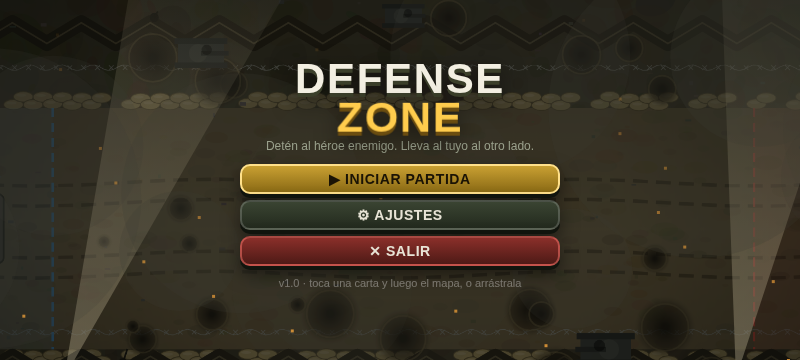
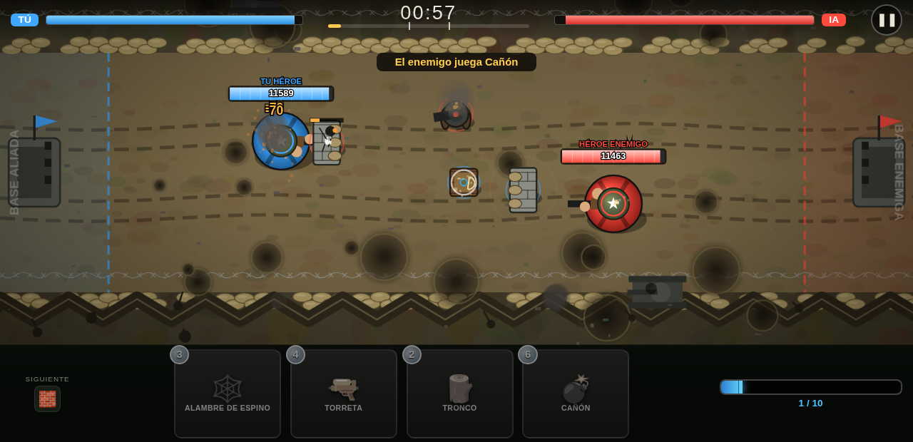

# Defense Zone

Juego para Android de defensa 1 contra 1 con cámara cenital: dos héroes salen
de extremos opuestos de un mapa lineal en ambiente de guerra; cada uno quiere
llegar a la base contraria. Usa cartas (maná estilo Clash Royale) — muro,
torreta, tronco, torre de arquero, alambre de espino y cañón — para frenar y
derribar al héroe enemigo antes de que él haga lo mismo con el tuyo.

- Partida de 15 min. Lluvia de 6:00 a 8:00. A partir de 9:00 todo va al doble
  de velocidad (movimiento, ataques y recarga de maná).
- Maná máximo 10; cartas de 2 a 6 de maná.
- Menú principal, ajustes (calidad, música, efectos), pausa, victoria/derrota.




Las decisiones de diseño y su motivación están en [handoff.md](handoff.md).

## Ejecutar en el navegador (desarrollo)

```bash
cd defense-zone/game
python3 -m http.server 8123
# abre http://localhost:8123/ en Chrome/Edge (apaisado)
```

Hace falta un servidor (no `file://`) porque usa módulos ES. Con `Esc` se
pausa; `window.__dz` expone el estado para depurar.

## Compilar el APK

Requisitos: Android Studio (o JDK 17 + SDK de Android con platform 35 y
build-tools 35).

```bash
cd defense-zone/android
./gradlew assembleDebug          # → app/build/outputs/apk/debug/app-debug.apk
```

O abre la carpeta `android/` en Android Studio y ejecuta. El juego (`../game`)
se empaqueta automáticamente como assets del APK; no hay que copiar nada.

## Balance

Todos los números están en `game/js/config.js`. Para comprobar el efecto de un
cambio sin jugar, simula partidas IA contra IA:

```bash
node tools/simulate.mjs 30 1     # 30 partidas, semilla 1
```
